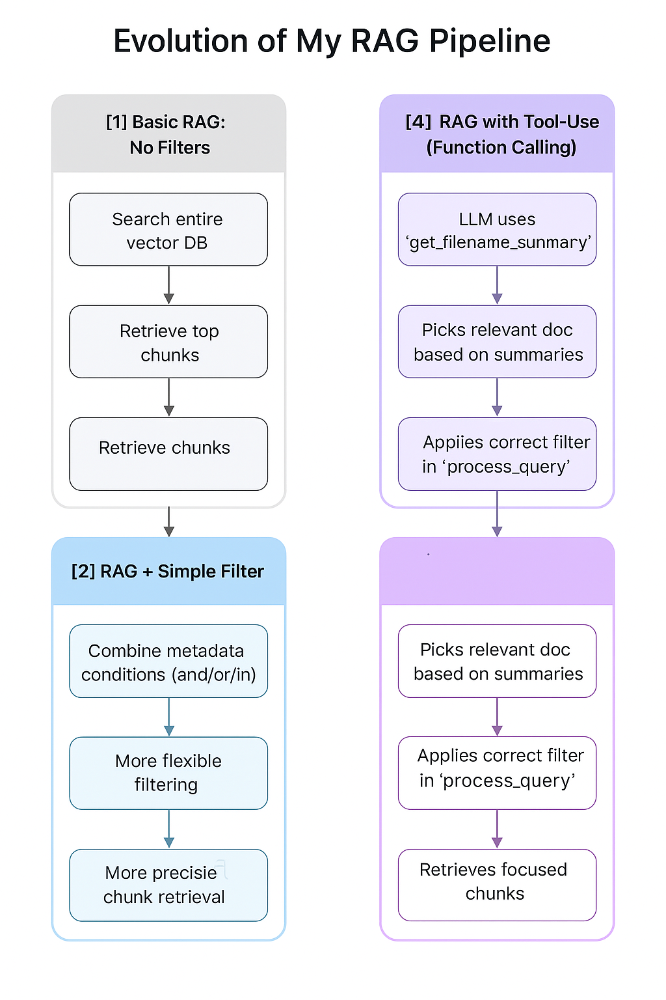

# Mistral AI demo

### "Technical Take-Home" Prompt:
Using any frameworks, vectorDBs and APIs of your choice build a RAG pipeline to build a question answering system with Mistral-7B (you can consume these models via API on La Platforme if you prefer: https://docs.mistral.ai/deployment/laplateforme/overview/) in Google Colab. Does not need to be optimized but has to be logically sound.
Be prepared to answer how you would scale the model and adapt it to real world deployments. Please be prepared to dig a bit deeper into the nature of the use case, choices you made, how you would extend it, and deeper questions regarding use of ML/LLMs. Please don't spend more than 3 hours on the coding component.

## Evolution of My RAG Pipeline

This project explores different levels of complexity in a Retrieval-Augmented Generation (RAG) system using AWS Knowledge Base and Mistral API.

The pipeline is structured into four stages, each introducing new filtering and control capabilities:

### 1️⃣ Basic RAG: No Filters
- Searches the entire vector database.
- Retrieves top N similar chunks without considering metadata or document context.

### 2️⃣ RAG + Simple Filter
- Adds metadata-based filtering (e.g., by filename or year).
- Uses Boolean logic (AND/OR/IN) to improve retrieval precision.

### 3️⃣ RAG + Dynamic Filters
- Allows more complex filter conditions based on the input question.
- Simulates reasoning before retrieval (e.g., deducing relevant year or topic).

### 4️⃣ RAG with Tool-Use (Function Calling)
- Uses an LLM to call a function (e.g., `get_filename_summary`) and decide which document to query.
- Applies the correct filter dynamically based on the summary.
- Enables smarter, automated query refinement for high-level questions.

### 📊 Visual Overview

